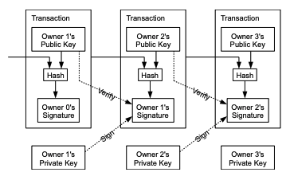
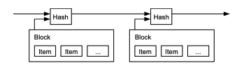

# Take a look Bitcoin white paper
비트코인 백서 톺아보기

## Abstract:
A purely peer-to-peer version of electronic cash would allow online
payments to be sent directly from one party to another without going through a
financial institution

: 개인 대 개인의 온라인 결제를 금융기관을 거치지 않고 이뤄질 것이다.

The network timestamps transactions by hashing them into an ongoing chain of
hash-based proof-of-work, forming a record that cannot be changed without redoing
the proof-of-work

: 네트워크는 거래를 해싱해 타임스탬프를 찍어 해시 기반 작업증명을 연결할 사슬로 만든다.
-> 블록 체인

nodes can leave and rejoin the network at will, accepting the longest
proof-of-work chain as proof of what happened while they were gone.

: 노드는 네트워크를 떠났다 올 수 있다. 가장 긴 작업 증명 체인을 가져오면 그동안 있었던 일들을 모두 알 수 있기 때문이다.

## 1. Introduction
What is needed is an electronic payment system based on cryptographic proof instead of trust,
allowing any two willing parties to transact directly with each other without the need for a trusted
third party

: 필요한 것은 신뢰 대신 암호학적 증명에 기반하고 신뢰받는 제 3자를 필요로 하지 않는 전자 결제 시스템이다.

## 2. Transactions

Each owner transfers the coin to the
next by digitally signing a hash of the previous transaction and the public key of the next owner
and adding these to the end of the coin.

: 각각의 사용자는 전자 서명(이전 거래의 해시값과 다음 소유자의 공개 키값)을 코인의 마지막에 추가를 통해 코인을 전송한다.

The problem of course is the payee can't verify that one of the owners did not double-spend
the coin. We need a way for the payee to know that the previous owners did not sign any earlier
transactions. 

: 이 과정상의 문제는 수금자가 소유자들중 하나가 이중지불 했는지의 여부를 확인할 수 없다.
우리는 수금자가 이전 소유자들이 앞선 거래에서 서명하지 않았다는 것을 알 수 있는 방법이 필요하다.

## 3. Timestamp Server
일종의 블록체인

