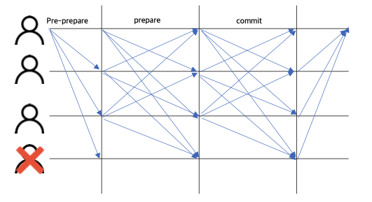

# Consensus
- Consensus: 합의

#### 비잔틴 장군 문제
- 특정 수 이상의 장군이 동시에 공격을 해야 성을 공략할 수 있다.
- 서로 P2P로만 연락을 주고 받을 때, 첩자의 방해가 있더라도 이 공격을 성공시키는 방법은?

## BFT 

- Byzantine Fault Tolerance(BFT) 란 분산화된 네트워크에서 일부 장애가 발생하더라도 네트워크가 정상적으로 동작할 수 있도록 하는 알고리즘
- PBFT(Practical BFT)가 블록체인 생태계에서 많이 사용되고 있으며, Cosmos, Hyperledger 등에서 사용되고 있음
  - 비동기 네트워크에서 배신자 노드가 f개 있을 때, 총 노드 개수가 3f+1개 이상이면 해당 네트워크에서 이루어지는 합의는 신뢰할 수 있다는 것을 수학적으로 증명한 알고리즘
  - CFT 는 분산시스템에서 노드가 비정상적인 충돌에 의해 문제가 생기더라도 나머지 시스템에서 서비스를 할 수 있게 하는 작동을 말한다면, BFT는 의도적 악의에 의한 문제까지도 해결하는 방식을 말한다.

## Proof Of Work(POW)
- Computing Power로 Double Spending과 같은 거래 위변조 공격을 막는 방법
- 새로운 블록을 생성하는 것이고 그 방법은 그 블록 내에 Field로 포함되는 Nonce값을 찾는 것
- 전체 Network Hash에 따라 Difficulty 가 변화하고, 10분마다 Block이 생성되게 조정
  - Network Hash Rate가 채굴자들이 늘어남에 따라 증가
  - 채굴의 속도가 점점 빨라짐에 따라 난이도 조절
  - Header Hash의 0의 갯수 증가
  - 난이도는 2016 block마다 조정

## Longest Chain Rule
- Longest Chain Rule은 Bitcoin Network 전체가 Fork가 발생할 때, 하나의 블록체인만을 유지하기 위한 방법
- 실제 Rule은 전체 Blockchain Fork 중 BlockChain 생성에 가장 많은 Computing Power가 사용된 Chain이 Main Chain이 되게 됨

## 블록체인 네트워크 공격의 종류
- Double Spending Attack(51% Attack)
- Sybil Attack
- DoS(Denial of Service) Attack

### Double Spending Attack(51% Attack)
- 동일한 UTXO로 두 개의 거래를 생성하고 Fork를 통해서 공격자가 원하는 거래만 블록에 포함되게 하는 공격
- 공격자가 더 긴 블록체인을 만들기 위해서는 전체 네트워크 HashRate의 51%를 가져야 성공 가능성이 높음

### Sybil Attack
- Sybil Attack이란 공격자가 수 많은 노드를 운영하면서 비트코인 네트워크 Block 전파를 방해하거나 잘못된 Block Data를 인접노드들에게 전송하는 공격
- Sybil Attack 을 하게 된 노드는 비정상적인 행동을 하는 노드로 판단되어 인접 노드들과의 연결이 끊어지게 되고 자연스럽게 Bitcoin 네트워크에서 분리되게 됨

### DoS(Denial of Service) Attack
- DoS Attack 이란 특정 노드들에 비정상적인 거래를 무한정 생성되어 네트워크 전체의 마비를 이르키는 공격
- Bitcoin 에서는 아래와 같은 방법으로 예방
  1) 비정상적인 거래, 블록은 전파하지 않음
  2) 이중 지불 공격은 전파하지 않음
  3) 같은 노드에서 전송된 동일 블록과 거래는 전파하지 않음
  4) 아주 작은 단위의 거래를 전송(Mempool Flooding Attack)