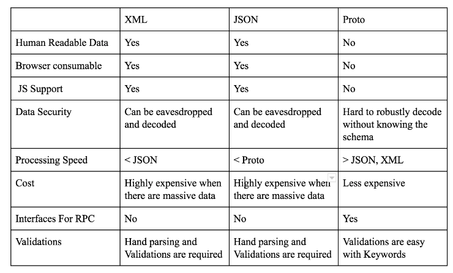
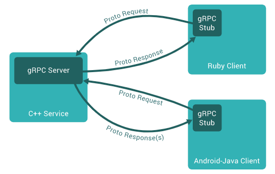

# Network 기본 및 gRPC

## Network 구조
###  Client - Server 구조
- 서버 및 클라이언트가 서버에 연결
- 서비스에 대한 클라이언트 요청에 대해 서버가 응답하는 방식
- 정보 공유에 중점
- 데이터는 중앙 집중식 서버에 저장
- 여러 클라이언트가 동시에 서비스 요청시 서비스 병목 현상 발생 가능
- 구현 비용이 비쌈
- 안정적이고 확장이 가능
### P2P Network 구조
  - 클라이언트와 서버 구별없이 활용 
  - 각 노드가 서비스를 요청하고 제공할 수 있음
  - 연결성에 중점
  - 각 노드가 자체 데이터 보유
  - 분산된 서버에 의해 제공되므로 병목 현상 발생 가능성 낮음
  - 구현 비용이 저렴
  - 노드의 수가 증가하면 문제 발생 가능성 증가
    - 데이터 sync 문제 등
  
    
    
### OSI 7 Layer 과 TCP/IP 4 Layer

### TCP
- 서버와 Client간에 데이터를 신뢰성 있게 전달하기 위해 만들어진 프로토콜
- 데이터 전송을 위한 연결을 만드는 연결지향 프로토콜
- 데이터 전송 과정에서 손실이나 순서가 바뀌는 경우 교정 및 순서 재조합 지원
- IPC(Inter Process Communication)에서 Socket 통신 방법으로 보통 지원

### HTTP 1.0 / 1.1 / 2.0
#### HTTP 1.0
- Connection 당 하나의 요청을 처리
- 동시 전송이 불가능하고 하나의 요청에 대한 응답 이후 다음 요청 처리
- 멀티미디어 리소스(ex. 이미지)들이 있는 상황에서 네트워크 지연 발생

#### HTTP 1.1
- HTTP Pipelining 도입
- TCP 내부에 두개 이상의 HTTP 요청을 담아 네트워크 지연 감소
- HOL(Head of Line) Blocking 문제
  - 앞선 요청에 의해 뒤에 요청이 지연되는 것을 의미
  - **요청한 순서대로 응답을 해야하기 때문에 발생**
- 2.0 등장 이전의 노력
  - Image Spriting
  - Domain Sharding
  - CSS, Javascript 최소화

#### HTTP 2.0
- Multiplexed Streams
  - 하나의 Connection으로 동시에 여러개의 메세지를 주고 받음
  - 응답은 Stream으로 받기 때문에 요청 순서와 상관없이 반환
  - Stream Prioritization
    - 응답에 우선순위를 정해 우선 순위가 높을수록 응답이 빠름
- Server Push
  - 서버가 클라이언트 요청 없이 응답을 보내는 것이 가능
- Header Compression
  - 항상 함께 보내야하는 Header 자원의 낭비를 줄이기 위해 Header Table을 사용
  - 기존에 사용된 Header 값은 table의 index만 전송
  
### Web Socket
- 실시간 양방향 통신 지원
- Application Layer 레벨 Protocol로 TCP/IP 위에서 동작
- 한번 연결이 수립되면 클라이언트와 서버 자유롭게 데이터 전송 가능
- 실시간시세데이터,채팅솔루션등에사용

## gRPC
### RPC
- RPC(Remote Procedure Call)이란 원격 서버의 함수를 호출 할 수 있는 통신 기술
- IDL(Interface Definition Language)을 사용하여 호출 규약을 정의하고 이를 통해 Stub코드를 생성
- Program에서는 Stub을 Call 함으로서 개발자는 네트워크에 대한 지식 없이 원격 함수 호출이 가능

### IDL(Interface Definition Language)
- 프로토콜: 서버와 클라이언트가 정보를 주고 받는 규칙
- IDL: 정보를 저장하는 규칙
- 대표적인 종류 XML, JSON, Protocol buffers(proto)

#### Protocol buffers(proto)
- 구조화(structured)된 데이터를 직렬화(serialization)하기 위한 프로토콜로 XML보다 작고 빠르고 간단
- 파일 크기가 3에서 10배 정도 작다
- 속도가 20에서 100배 정도 빠르다
- XML보다 가독성이 좋고 명시적이다
- 현재 proto2와 proto3가 있으며, proto3의 사용을 권장

#### XML, JSON, proto

### gRPC

- gRPC는 구글에서 만든 RPC 플랫폼이며 protocol buffer와 RPC를 사용
- SSL/TLS를 사용하여 서버를 인증하고 클라이언트와 서버간에 교환되는 모든 데이터를 암호화
- HTTP 2.0을 사용하여 성능이 뛰어나고 확장 가능한 API를 지원
- gRPC를 이용하면 원격에 있는 애플리케이션의 메서드를 로컬 메서드인 것처럼 직접 호출할 수 있기 때문에 분산 애플리케이션과 서비스를 보다 쉽게 만들 수 있음

#### stub
- stub는 RPC의 핵심 개념으로 Parameter 객체를 Message로 Marshalling/Unmarshalling하는 레이어
- 서버와 클라이언트는 서로 다른 주소 공간을 사용하므로 함수 호출에 사용된 매개 변수 변환 필요
  - 미변환시 메모리 매개 변수에 대한 포인터가 다른 데이터를 가리키게 되기 때문
- client의 stub은 함수 호출에 사용된 파라미터의 변환(marshalling) 및 함수 실행 후 서버에서 전달된 결과의 변환 담당
- server의 stub은 클라이언트가 전달한 매개 변수의 역변환(unmarshalling) 및 함수 실행 결과 변환을 담당

## 참고한 자료
한 번에 끝내는 블록체인 개발 A to Z
https://ssungkang.tistory.com/entry/%EB%84%A4%ED%8A%B8%EC%9B%8C%ED%81%AC-HTTP-11-VS-HTTP-20
https://chacha95.github.io/2020-06-15-gRPC1/
https://velog.io/@dojun527/gRPC%EB%9E%80