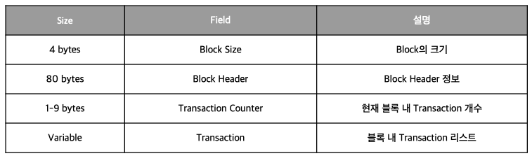
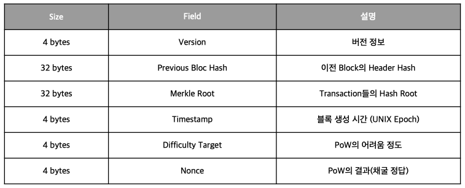
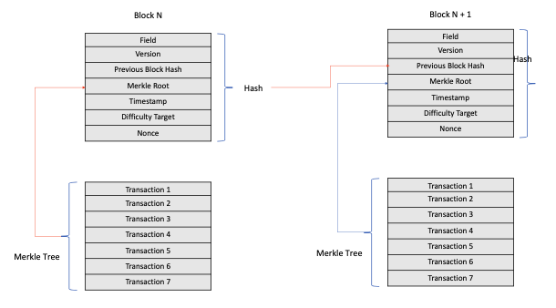

# Block Structure

## Block 구조


## Block Header 구조


## Genesis Block
Genesis Block은 Block의 최초 검증 데이터로 Genesis Block이 다르게 되면
그 뒤에 연결되는 모든 Blockchain 데이터 검증이 불가능

Bitcoin의 Genesis Block
```
GetHash()      = 0x000000000019d6689c085ae165831e934ff763ae46a2a6c172b3f1b60a8ce26f
hashMerkleRoot = 0x4a5e1e4baab89f3a32518a88c31bc87f618f76673e2cc77ab2127b7afdeda33b
txNew.vin[0].scriptSig     = 486604799 4 0x736B6E616220726F662074756F6C69616220646E6F63657320666F206B6E697262206E6F20726F6C6C65636E61684320393030322F6E614A2F33302073656D695420656854
txNew.vout[0].nValue       = 5000000000
txNew.vout[0].scriptPubKey = 0x5F1DF16B2B704C8A578D0BBAF74D385CDE12C11EE50455F3C438EF4C3FBCF649B6DE611FEAE06279A60939E028A8D65C10B73071A6F16719274855FEB0FD8A6704 OP_CHECKSIG
block.nVersion = 1
block.nTime    = 1231006505
block.nBits    = 0x1d00ffff
block.nNonce   = 2083236893

CBlock(hash=000000000019d6, ver=1, hashPrevBlock=00000000000000, hashMerkleRoot=4a5e1e, nTime=1231006505, nBits=1d00ffff, nNonce=2083236893, vtx=1)
  CTransaction(hash=4a5e1e, ver=1, vin.size=1, vout.size=1, nLockTime=0)
    CTxIn(COutPoint(000000, -1), coinbase 04ffff001d0104455468652054696d65732030332f4a616e2f32303039204368616e63656c6c6f72206f6e206272696e6b206f66207365636f6e64206261696c6f757420666f722062616e6b73)
    CTxOut(nValue=50.00000000, scriptPubKey=0x5F1DF16B2B704C8A578D0B)
  vMerkleTree: 4a5e1e
```

## Block 생성
거래와 블록이 생성되는 과정을 자세히 보고 싶다면 아래 주소를 참고
https://steemit.com/kr/@niipoong/bitcoin-tx-and-block-store-process

1. Mempool Tx 선택
   - 새로 등록된 거래들 중 Block으로 생성할 거래 선택
   - Database 성능으로 인해 Bitcoin에서는 2000개가 최대
   - 채굴자들은 이런 Block 크기의 제한으로 인해 거래 수수료를 최대한을 많이 얻는 방법을 구현
     - 수수료가 비싸거나 거래 데이터 용량이 작은 거래만 선택
2. Coinbase Tx 생성
    - 채굴자가 받을 거래 생성
3. Merkle Root 연산
   - Tx들로 부터 Merkle Root 연산 
4. Block Header 구성
    - 생성된 정보들로 Block Header 구성
5. Find Nonce(Pow)
    - 작업증명(채굴)
6. Block 전파

## Block 연결 방법


이전 Block의 Hash와 Merkel Root의 Hash 값을 통해 그 전 데이터들의 유효성을 검증
-> 이전 데이터로 새로운 데이터 생성 -> 블록체인


## 참고한 자료
한 번에 끝내는 블록체인 개발 A to Z
https://en.bitcoin.it/wiki/Genesis_block
https://steemit.com/kr/@niipoong/bitcoin-tx-and-block-store-process