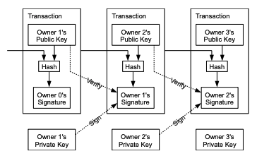
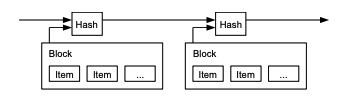
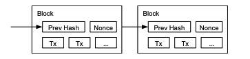
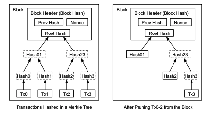
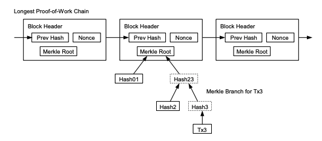
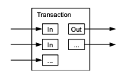
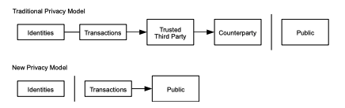

# Take a look Bitcoin white paper
비트코인 백서 훑어보기

## Abstract:
A purely peer-to-peer version of electronic cash would allow online
payments to be sent directly from one party to another without going through a
financial institution

: 개인 대 개인의 온라인 결제를 금융기관을 거치지 않고 이뤄질 것이다.

The network timestamps transactions by hashing them into an ongoing chain of
hash-based proof-of-work, forming a record that cannot be changed without redoing
the proof-of-work

: 네트워크는 거래를 해싱해 타임스탬프를 찍어 해시 기반 작업증명을 연결할 사슬로 만든다.
-> 블록 체인

nodes can leave and rejoin the network at will, accepting the longest
proof-of-work chain as proof of what happened while they were gone.

: 노드는 네트워크를 떠났다 올 수 있다. 가장 긴 작업 증명 체인을 가져오면 그동안 있었던 일들을 모두 알 수 있기 때문이다.

## 1. Introduction
What is needed is an electronic payment system based on cryptographic proof instead of trust,
allowing any two willing parties to transact directly with each other without the need for a trusted
third party

: 필요한 것은 신뢰 대신 암호학적 증명에 기반하고 신뢰받는 제 3자를 필요로 하지 않는 전자 결제 시스템이다.

## 2. Transactions

Each owner transfers the coin to the
next by digitally signing a hash of the previous transaction and the public key of the next owner
and adding these to the end of the coin.

: 각각의 사용자는 전자 서명(이전 거래의 해시값과 다음 소유자의 공개 키값)을 코인의 마지막에 추가를 통해 코인을 전송한다.

The problem of course is the payee can't verify that one of the owners did not double-spend
the coin. We need a way for the payee to know that the previous owners did not sign any earlier
transactions. 

: 이 과정상의 문제는 수금자가 소유자들중 하나가 이중지불 했는지의 여부를 확인할 수 없다.
우리는 수금자가 이전 소유자들이 앞선 거래에서 서명하지 않았다는 것을 알 수 있는 방법이 필요하다.

## 3. Timestamp Server
일종의 블록체인

A timestamp server works by taking a
hash of a block of items to be timestamped and widely publishing the hash.
Each timestamp includes the previous timestamp in
its hash, forming a chain, with each additional timestamp reinforcing the ones before it.

: 타임스탬프 서버는 해시 블록의 아이템들의 타임스탬프를 찍고 해시를
널리 배포한다.(!정확한 번역이 아닐수도 있습니다.) 각각의 타임스탬프는 이전의 타임스탬프를 해시에 보관하고 다음 타임스탬프를 추가적으로 연장하여 체인을 만든다.

## 4. Proof-of-Work
작업 증명

The proof-of-work involves scanning for a value that when hashed, such as with SHA-256, the
hash begins with a number of zero bits.
The average work required is exponential in the number
of zero bits required and can be verified by executing a single hash.
The majority
decision is represented by the longest chain, which has the greatest proof-of-work effort invested
in it

작업증명은 SHA-256 같은 알고리즘으로 해시가 되었을 때 해당 해시값의 시작하는 0의 갯수가 원하는 숫자만큼이 나올 때 까지 반복한다.
평균 작업 속도는 0이 늘어날수록 기하급수적으로 증가하고 단 한 번의 해시를 통해 인증할 수 있다. 
주 결정은 가장 긴 체인으로 대표되며 그것은 가장 큰 노력이 투자된 것이다.

## 5. Network
1) New transactions are broadcast to all nodes.
2) Each node collects new transactions into a block.
3) Each node works on finding a difficult proof-of-work for its block.
4) When a node finds a proof-of-work, it broadcasts the block to all nodes.
5) Nodes accept the block only if all transactions in it are valid and not already spent.
6) Nodes express their acceptance of the block by working on creating the next block in the
   chain, using the hash of the accepted block as the previous hash

1) 새로운 거래가 모든 노드에 브로드캐스트된다.
2) 각 노드가 새로운 거래를 블록에 수집한다.
3) 각 노드가 해당 블록에 맞는 난도의 작업증명을 찾아 나선다.
4) 노드가 작업증명을 찾으면, 해당 블록을 모든 노드로 브로드캐스트한다.
5) 노드들은 모든 거래가 유효하며 아직 지불되지 않았다는 조건에 맞을 경우에만 그 블록을 승인한다.
6) 노드들은 이전 해시로 승인된 블록의 해시를 사용해, 다음 블록을 체인 안에 생성함으로써 해당 블록이 승인 되었음을 표현한다.

## 6. Incentive
By convention, the first transaction in a block is a special transaction that starts a new coin owned
by the creator of the block. The incentive can also be funded with transaction fees.

관례상 블록에서의 첫 거래는 해당 블록을 만든 생성자가 새로운 화폐를 가지는 특별한 거래다. 인센티브는 거래 수수료로 충당될 수도 있다.

우리가 아는 채굴이란 이러한 작업 증명을 해줌으로써 받는 수수료를 얻는 것을 뜻한다. 하나의 노드가 되어 블록의 작업 증명을 해주는 것이다.

## 7. Reclaiming Disk Space

Once the latest transaction in a coin is buried under enough blocks, the spent transactions before
it can be discarded to save disk space. To facilitate this without breaking the block's hash,
transactions are hashed in a Merkle Tree, with only the root included in the block's hash.
Old blocks can then be compacted by stubbing off branches of the tree. The interior hashes do
not need to be stored.

화폐의 가장 최근 거래가 충분한 수의 블록 아래에 묻히면, 그 전에 지불된 거래는 디스크 공간을 절약하기 위해 폐기될 수 있다. 
이런 작업을 블록의 해시를 깨지 않으면서 하기 위해, 거래는 머클트리(Merkle Tree)안에 해시되며, 
그 트리의 루트(root)만이 블록의 해시 안에 포함된다. 
이런 방식을 적용하게 되면, 오래된 블록은 트리의 분기를 쳐냄으로써 크기가 작아질 수 있다. 내부의 해시는 저장될 필요가 없다.

## 8. Simplified Payment Verification

It is possible to verify payments without running a full network node. A user only needs to keep
a copy of the block headers of the longest proof-of-work chain, which he can get by querying
network nodes until he's convinced he has the longest chain, and obtain the Merkle branch
linking the transaction to the block it's timestamped in.

결제 검증은 네트워크의 모든 노드를 다 구동하지 않아도 가능하다.
사용자는 자신이 가장 긴 작업증명 체인을 가졌다고 확신할 때까지 네트워크 노드를 조회해, 
얻을 수 있는 가장 긴 체인의 블록 헤더(header) 복사본을 유지하면서, 타임스탬프가 찍힌 블록에 연결된 머클 분기를 얻기만 하면 된다

## 9. Combining and Splitting Value

Normally there will be either a single input
from a larger previous transaction or multiple inputs combining smaller amounts, and at most two
outputs: one for the payment, and one returning the change, if any, back to the sender

일반적으로 입금은 더 큰 이전 거래의 단일 입금이거나 더 작은 거래들을 결합한 복수 입금이며, 출금은 지불용 출금과 만일 있다면 발생해야 하는 송금인(sender)에게 되돌려줄 거스름돈 출금, 이렇게 많아야 둘이다.

## 10. Privacy

The necessity to announce all transactions publicly
precludes this method, but privacy can still be maintained by breaking the flow of information in
another place: by keeping public keys anonymous

모든 거래는 공개되어야 하기 때문에 이러한 방법은 불가능하지만, 공개키 익명성을 보존해 다른 장소에 있는 정보의 흐름을 끊는 것으로 프라이버시가 여전히 보장될 수 있다.

## 참고한 자료
한 번에 끝내는 블록체인 개발 A to Z
https://bitcoin.org/bitcoin.pdf