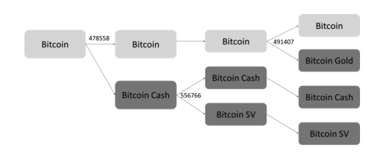
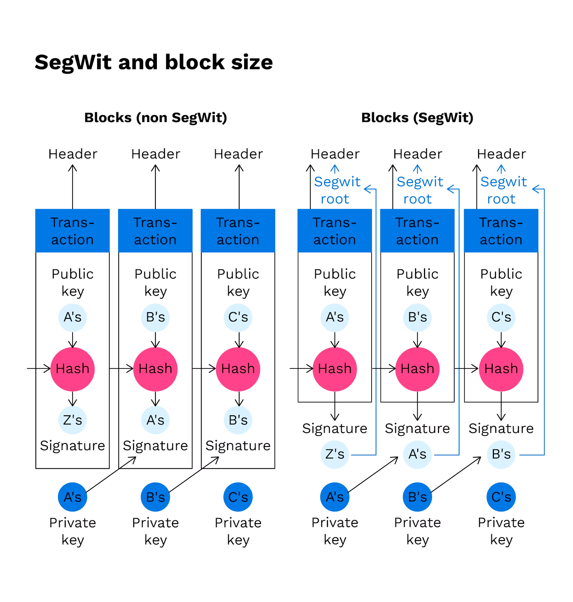

# Hard Fork, Soft Fork

## Fork
- Bitcoin은 노드가 글로벌하게 분포되어 있으며, 각 채굴자들은 모두 동시에 PoW를 통해 신규 블록을 채굴
- 두 노드가 동시에 블록 정답(Nonce) 찾기에 성공하는 경우
  - Blockchain Network가 일시적으로 분기되었다고 이야기하고 이를 Fork 라고 부른다.
  - Bitcoin Block은 어떤 Block이 전달될지 모르기 때문에, Fork 발생 시 2개의 Chain을 가지고 있으며, 이 중 Longest Chain을 Main Chain으로 유지
  - Main Branch가 Longest가 아님을 알게 된 순간, Side Branch를 Main으로 변경하고 이에 대한 LevelDB 업데이트
- Bitcoin은 Longest Blockchain Rule을 통해 이렇게 Fork 된 네트워크를 하나로 유지

## Soft Fork
- 기존의 규칙에서 큰 틀은 바꾸지 않고, 부분적인 업데이트만 이루어짐
- 포크가 이루어지기 전의 블록과 후의 블록이 서로 호환 가능
- 대표적인 예시 SegWit(Separated Witness)
  - 비트코인의 블록에서 디지털 서명 부분만 분리하여 블록의 용량을 증가시키는 업데이트(4MB)
  - 기존의 블록체인은 SegWit 업데이트로 생성된 블록이 들어오면 그대로 통과 -> 계속 연결
  - SegWit 블록은 SegWit 블록만이 유효성 검증
  - SegWit 업데이트로 채굴 장비(ASIC)이 무용지물 -> 채굴자들이 네트워크 분리(Hard Fork) -> 비트코인 캐시

## Hard Fork

- 모든 노드가 업데이트를 진행한다면 네트워크 분리는 발생하지 않음
  - But 현실적으로 불가능 -> 네트워크 분리 발생
- 대부분의 기능은 동일하나 블록의 구조가 변경(ex. 블록의 용량 증가)
- 업데이트 전의 블록과 업데이트 후의 블록이 호환이 되지 않음
- 탈중앙화된 블록체인의 특성 상 새로운 업그레이드에 찬성하는 쪽과 반대한 쪽이 나뉨
  - 네트워크의 분리 -> 탈중앙화됨을 보여줌
  - 기존에 연결된 노드에서 서로 인정하는 블록이 달라짐
  - 자연스러운 네트워크의 분리 -> Hard Fork 발생
- 대표적인 예시 비트코인 캐시, 비트코인 SV, 비트코인 골드

## Bitcoin Cash
- Bitcoin Cash와 Bitcoin이 분리되게 된 원인은 새로운 Segwit 업그레이드가 기존 ASIC에서는 사용이 불가능하기 때문
- 채굴자 측에서는 블록 사이즈 문제는 블록 크기 증가(8MB)로 가능하다는 의견
- 개발진 측에서는 Segwit 적용이 블록체인 확장성 문제를 해결 가능하다는 의견
- 478559 번쨰 블록 부터 Bitcoin Cash가 BTC(Bitcoin) 거래를 거부하기 시작하며 네트워크 분리가 시작
- 네트워크 분리로 인해서 Bitcoin Network Hash Rate의 30% 정도가 사라짐
- Craig Wright(크레이그 라이트)는 Bitcoin Cash에서 2018년 8월 Bitcoin Cash의 Atomic Swap 업데이트에 반대하며 Bitcoin SV(128MB)로
Hard Fork를 진행

## SegWit

## 참고한 자료
- 한 번에 끝내는 블록체인 개발 A to Z
- https://contents.premium.naver.com/jwjung/villainfinance/contents/220325082816673Bh